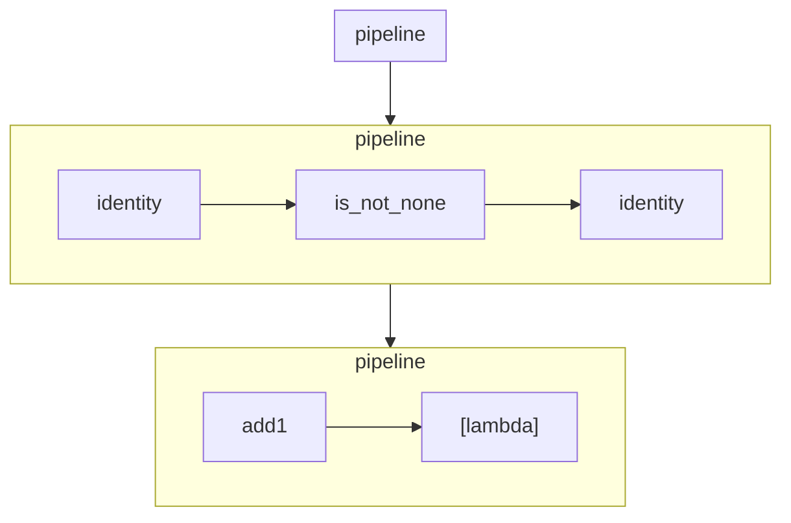

# picopipe
A small pipeline framework built on top of functions

```mermaid
flowchart
subgraph pipeline_98e33e0628b546268abb2af5f74e50f1 ["pipeline"]
end
subgraph pipeline_205813c806fd4b37b40309497768f7c1 ["pipeline"]
    node0["identity"]
    node1["is_not_none"]
    node2["identity"]
end
node0 --> node1
node1 --> node2
click node0 console.log "def&#8194;identity(value):<br/>&#8194;&#8194;&#8194;&#8194;return&#8194;value<br/>"
click node1 console.log "@pfilter<br/>def&#8194;is_not_none(v):<br/>&#8194;&#8194;&#8194;&#8194;return&#8194;v&#8194;is&#8194;not&#8194;None<br/>"
click node2 console.log "def&#8194;identity(value):<br/>&#8194;&#8194;&#8194;&#8194;return&#8194;value<br/>"
subgraph pipeline_d2f205ef957a428abbaa208241125819 ["pipeline"]
    node3["add1"]
    node4["[lambda]"]
end
node3 --> node4
click node3 console.log "def&#8194;add1(value):<br/>&#8194;&#8194;&#8194;&#8194;return&#8194;value&#8194;+&#8194;1<br/>"
click node4 console.log "lambda&#8194;...:&#8194;..."
pipeline_98e33e0628b546268abb2af5f74e50f1 --> pipeline_205813c806fd4b37b40309497768f7c1
pipeline_205813c806fd4b37b40309497768f7c1 --> pipeline_d2f205ef957a428abbaa208241125819
```
